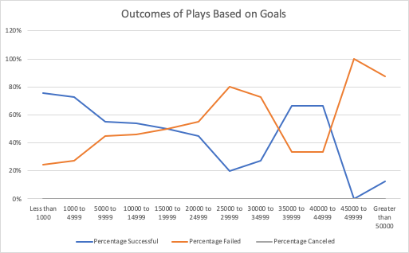

# Module 1: An Analysis of Kickstarter Campaigns
Performing analysis on 

### Challenge

*The trend shows that Kickstart play campaigns with lower goal amounts have higher chances of successful outcomes; meanwhile, those with more top goal amounts have higher chances of failure outcomes. The second graph shows that the theaters have the most successful outcomes in May and June as opposed to the downtrend from July to December. Thus, Lousie must consider setting the goal amount for the play campaigns from the range of values less than $1000 to $4999 as well as launching the plays in May and June. Since launching campaigns in December shows a significant drop in successful outcomes, it will be safe to avoid starting plays in the winter according to the analysis. 

Although the outcomes by launch date and goal amount are good ways to look at prospective outcomes of the campaigns, there a few limitations of the dataset. The basic descriptive statistics on mean, median, mode, and interquartile range with box and whisker plot would have been a valuable piece of the information. The box plot graph will grab readers' attention quickly, and it is easily readable to see whether the goal was way too far beyond the pledged amount. Another way to look at the goal and outcome is by looking at the duration of the campaigns. Adding another column with the length of how long the campaigns lasted will also help us better understand the outcomes. For the current analysis, it is hard to know whether campaigns that lasted longer had more successful outcomes than those didn't. Investigating relationships between different variables, especially within countries and between countries, can provide insightful stories in predicting which campaigns are highly likely to succeed.*
